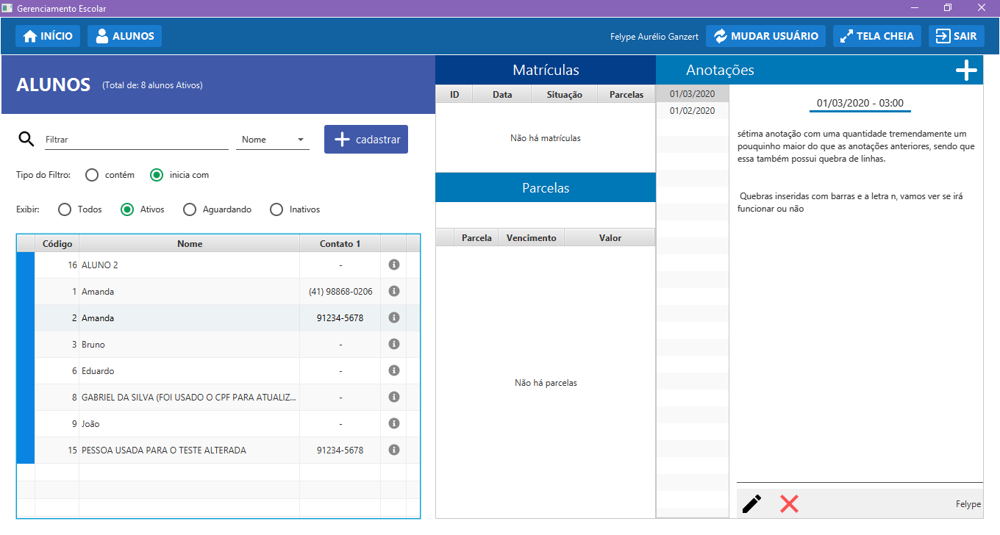
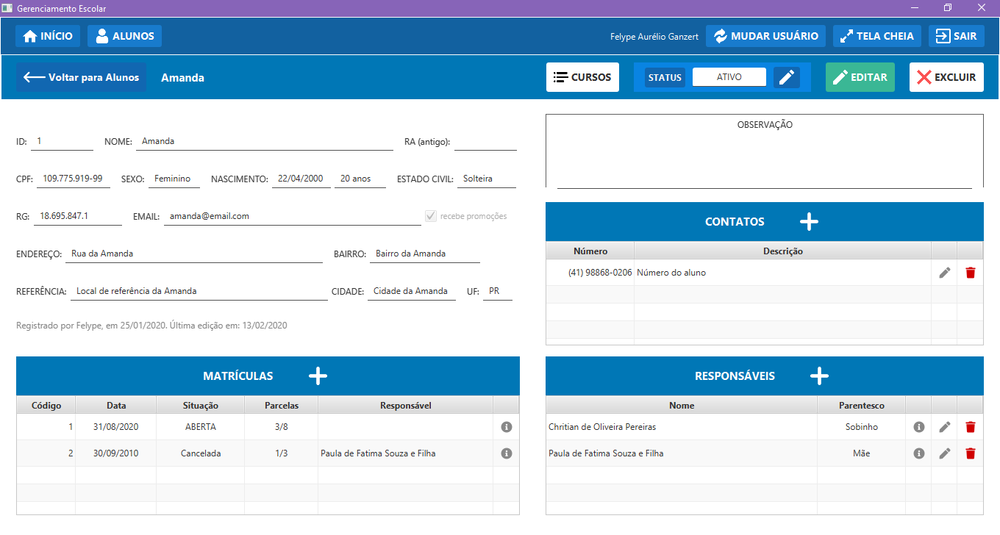
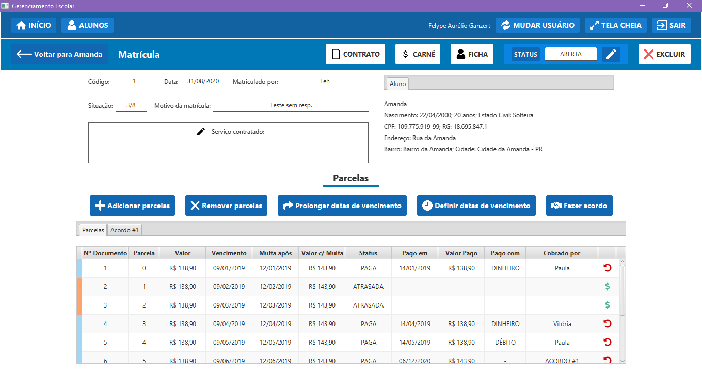
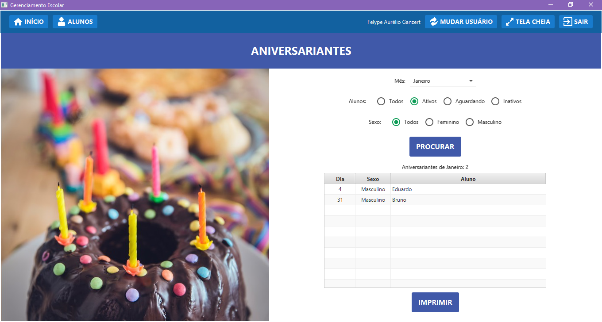
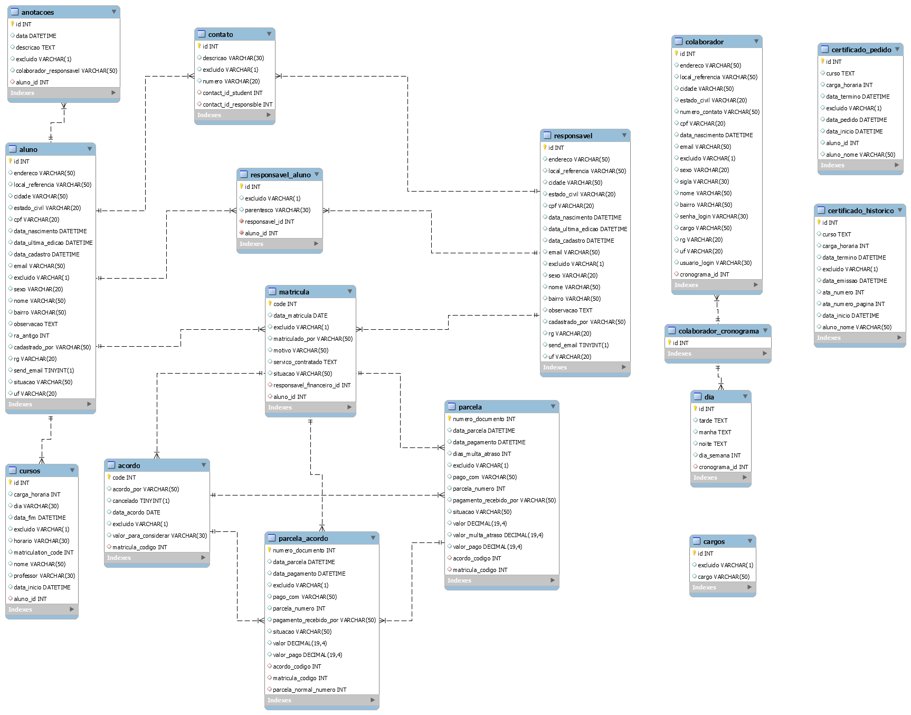

# SchoolManagement
School Management System build in JavaFX

## Justificativa
O principal objetivo do projeto foi colocar em prática todo o meu aprendizado em um sistema mais complexo e realmente desafiador usando como base a realidade e necessidades reais presentes em uma escola. Seu desenvolvimento foi desafiador e eu até que estou satisfeito com o resultado.
Hoje, boa parte da estrutura e da arquitetura do código eu vejo que eu deveria alterar, principalmente para evitar o forte acoplamento que está presente e alguns problemas que não deixam o código tão limpo e de fácil alterações. Mas o projeto foi fonte de grande aprendizado para mim. Agora é continuar estudando e evoluindo!

## Principais Funcionalidades
* Cadastrar Alunos e Responsáveis;
* Gerar Matrícula com N Parcelas;
* Cadastrar os cursos realizados por aluno;
* Gerenciar toda a parte de certificados (solicitação e histórico de emissão);
* Gerar Relatório de Aniversariantes;
* Visualizar Parcelas Atrasadas.

## Visualizar a aplicação
Caso queira visualizar o projeto funcionando, pode ser acessado o link: https://youtu.be/Y87rJn0J81Y

## Algumas telas









## Banco de Dados

Está sendo usado um banco de dados com o nome 'cadastroprojetos', com user = 'student' e password = 'student'.
Esses dados podem ser alterados na classe src/main/java/db/DBFactory.java

Diagrama UML do Banco de Dados atual:



Foi utilizado o MySQL para persistir os dados. Existe um arquivo dentro da pasta dump que pode ser usado para gerar a estrutura das tabelas do baco de dados.

Para ser possível acessar o sistema pode ser criado o seguinte usúario com user = "admin" e password = "admin":

````sql
insert into colaborador (id, nome, sigla, email, cargo, numero_contato, usuario_login, senha_login)
values (1, "ADMIN", "admin", "admin@email", "admin", null, "admin", "admin");
````

## Principais Dependências
* Java > 8
* JavaFx
* SceneBuilder 11
* Maven
  * Lombox (1.18.12)
  * Hibernate (5.40.20)
  * Entitymanager (5.40.20)
  * MySQL Connnector (8.0.21)
  * jFoenix (9.0.1)
  * AnimateFX (1.2.1)

## O que falta ser feito
- Basicamente toda a parte da emissão de Relatórios usando o iReport e algumas partes com o ApachePOI;

e:

### Matrículas
- [ ]  Registro: Selecionar serviços;
- [ ]  Registro: Selecionar planos de pagamento;
- [ ]  Matrículas: Imprimir Contrato (permitir selecionar diferentes modelos de contrato);
- [ ]  Matrículas: Imprimir ficha do Aluno (permitir selecionar diferentes modelos fichas de aluno);
- [ ]  Matrículas: Imprimir carnê (permitir que o usuário escolha quais parcelas serão impressas);
- [ ]  Acordo: Imprimir acordo (permitir selecionar diferentes modelos de acordo);

### Aniversariantes
- [ ]  Imprimir Relatório dos aniversariantes que foram pesquisados;

### Certificados
- [ ]  Histórico: Imprimir Relatório dos certificados emitidos (imprimir os dados que estão aparecendo na tela);
- [ ]  Solicitações e Todos os alunos: Gerar os relatórios e exibir eles no método PRINT;
- [ ]  Adicionar opção para escolher o (nome e carga horária de alguma lista);

### Chamada
- [ ]  PRINT: Criar tela para o usuário selecionar o modelo (.docx) que será usado para gerar a chamada, logo em seguida gerar e abrir o arquivo;

### Relatórios
- [ ]  ID | NOME | N. DE MENSALIDADES | VALOR DO TÍTULO normal | VALOR DO TÍTULO com a multa | MOTIVO | SITUAÇÃO DA TAXA MATRÍCULA | SITUAÇÃO 1 PARCELA | SITUAÇÃO 2 PARCELA | etc (?);
- [ ]  Data da matrícula | Código Aluno | Nome | serviço Contratado | n° de parcelas x valor normal de cada Parcela;
- [ ]  Criar opção para imprimir os dados que estão sendo apresentados nas tabelas das PARCELAS ATRASADAS;

### Usuários
- [ ]  Adicionar lógica para restrições e autorizações;

### Novas Telas
- [ ]  Tela de backup (fazer backup e recuperar a partir de backup);
- [ ]  Tela sobre o sistema e informações gerais sobre a versão e criador;
- [ ]  Tela com informações sobre a escola;
- [ ]  Tela que mostre algumas informações sobre a entrada de dinheiro e de parcelas pagas com gráficos;
- [ ]  Tela para alterar os PARÂMETROS do sistema: opções de serviços que podem ser contratados por uma matrícula | planos de pagamento | opções de curso para solicitação/emissão de certificados;
- [ ]  Relatórios: parcelas pagas em determinado período;
- [ ]  Relatórios: Todos os números de contatos;
- [ ]  Relatórios: Informações dos alunos;

## Contribuir

Provavelmente existem diversas outras possibilidades para melhorar ainda mais o sistema kkk.
Provavelmente não vou fazer essas novas funcionalidades tão cedo, pois o objetivo principal que era praticar JavaFx e outros conhecimentos já foi alcançado.

Se tiver interesse em contribuir com o projeto fique a vontade para fazer um -git clone :).